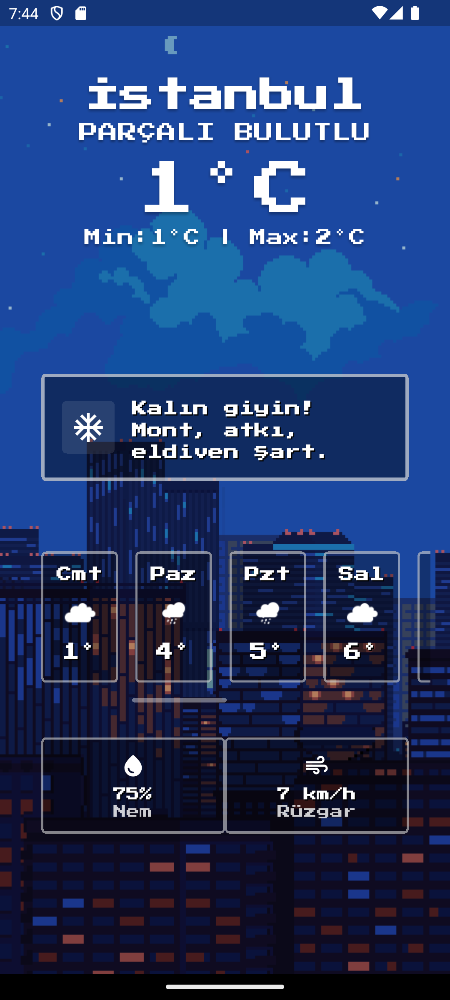
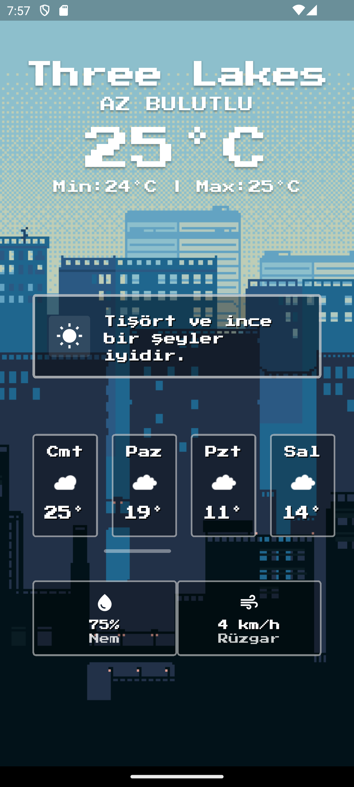
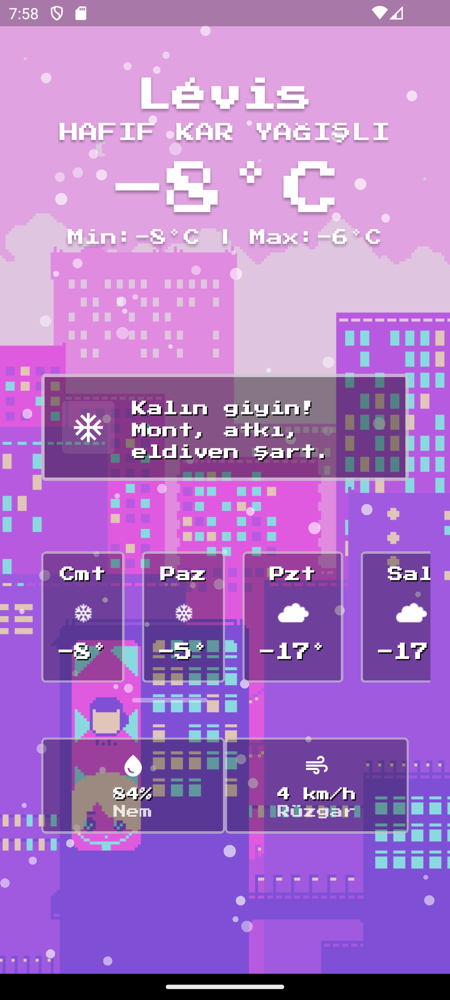
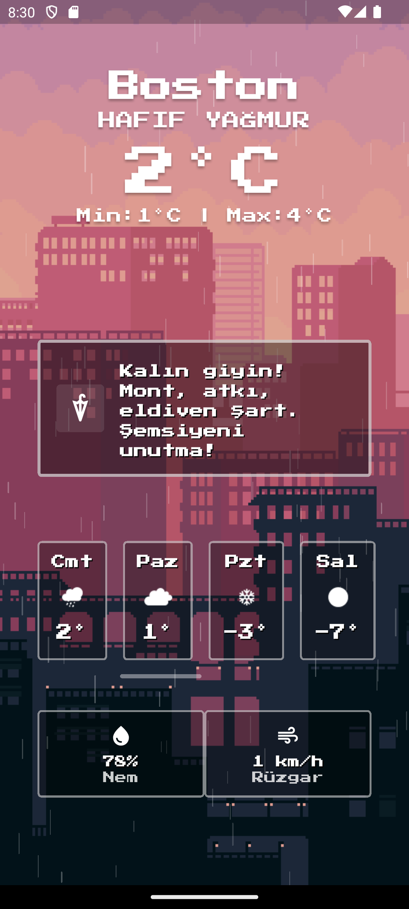

# Pixel Weather 🌦️

Nostaljik 8-bit estetiğini modern hava durumu tahminiyle birleştiren, pixel-art tarzında tasarlanmış güzel bir hava durumu uygulaması. Flutter ile geliştirilmiş bu uygulama, hava durumu verilerini sürükleyici bir retro oyun deneyimine dönüştürüyor.

## ✨ Özellikler

- **Retro Pixel Art Tasarım**: Hava koşullarına göre değişen dinamik arka planlı, sürükleyici 8-bit stilinde arayüz
- **Gerçek Zamanlı Hava Durumu Verileri**: Güvenilir hava durumu API'leri ile desteklenen doğru hava durumu bilgisi
- **Çok Günlük Tahmin**: Önümüzdeki günler için hava durumu tahminlerini görüntüleme
- **Dinamik Hava Koşulları**: Görsel temsiller mevcut hava durumuna adapte oluyor (yağmur, kar, bulutlu, vb.)
- **Yerelleştirilmiş İçerik**: Tam Türkçe dil desteği
- **Hava Durumu Detayları**: 
  - Min/max değerleriyle anlık sıcaklık
  - Nem seviyeleri
  - Rüzgar hızı
  - Hava durumu açıklamaları
- **Güzel Animasyonlar**: Pürüzsüz geçişler ve hava durumuna uygun görsel efektler

## 📸 Ekran Görüntüleri

<p align="center">
  
  
  
  
</p>

## 🚀 Başlangıç

### Gereksinimler

- Flutter SDK (>=3.0.0)
- Dart SDK (>=3.0.0)
- Android Studio / VS Code ve Flutter eklentileri

### Kurulum

1. Depoyu klonlayın
```bash
git clone https://github.com/emirhan-coban/pixel_weather.git
cd pixel_weather
```

2. Bağımlılıkları yükleyin
```bash
flutter pub get
```

3. Uygulamayı çalıştırın
```bash
flutter run
```

## 🛠️ Kullanılan Teknolojiler

- **Flutter** - UI framework
- **Dart** - Programlama dili
- **Weather API** - Gerçek zamanlı hava durumu verileri
- **Özel Pixel Art Görseller** - Elle hazırlanmış retro grafikler

## 🎨 Tasarım Felsefesi

Pixel Weather, retro oyunların cazibesini modern işlevsellikle birleştiriyor. Her hava durumu, nostalji uyandırırken bir bakışta temel hava durumu bilgilerini sunan, özenle tasarlanmış pixel art ile temsil ediliyor.

## 📱 Desteklenen Platformlar

- ✅ Android
- ✅ iOS
- 🔄 Web (Yakında)

## 🤝 Katkıda Bulunma

Katkılarınızı bekliyoruz! Şunları yapabilirsiniz:

1. Projeyi fork edin
2. Özellik dalınızı oluşturun (`git checkout -b feature/HarikaOzellik`)
3. Değişikliklerinizi commit edin (`git commit -m 'Harika bir özellik ekle'`)
4. Dalınıza push yapın (`git push origin feature/HarikaOzellik`)
5. Pull Request açın

## 👨‍💻 Geliştirici

**Emirhan Çoban**

- GitHub: [@emirhan-coban](https://github.com/emirhan-coban)
- LinkedIn: [Emirhan Çoban]([https://www.linkedin.com/in/emirhan-coban](https://www.linkedin.com/in/emirhan-%C3%A7oban-b09951286/))

## 🙏 Teşekkürler

- Hava durumu verileri [OpenWeatherMap] tarafından sağlanmaktadır.
- Klasik 8-bit oyunlar ve pixel art estetiğinden ilham alınmıştır.
- Harika kaynaklar için Flutter topluluğuna teşekkürler.
